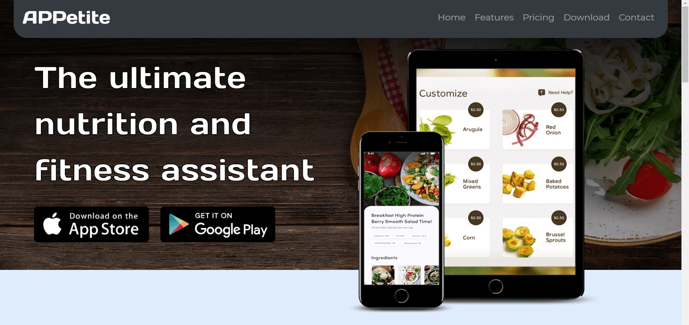

# APPetite

A mockup landing page for a model diet app website made using Bootstrap v4.4.0.
---
[](https://soumik-dhar.github.io/APPetite-Landing-Page/)

APPetite is a dummy landing page for a nutrition and fitness assistant application built using Bootstrap features some of which include -
* Navbar
* Cards
* Carousels
---
### Using APPetite

From the command line, execute the following:

```bash
# Clone this repository
$ git clone https://github.com/Soumik-Dhar/APPetite-Landing-Page.git
```
```bash
# Go into the repository
$ cd APPetite-Landing-Page
```
```bash
# Launch index.html on your browser
$ start index.html # On Windows
$ open index.html # On Linux/Mac
```
Check out the website here -> [APPetite](https://soumik-dhar.github.io/APPetite-Landing-Page/)

---
### License
>You can check out the full license [here](LICENSE.md)

This project is licensed under the terms of the **MIT** license.
